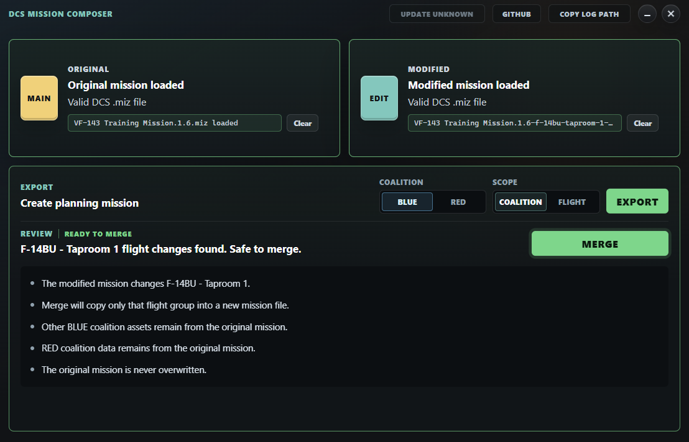

# DCS Mission Composer

DCS Mission Composer is a desktop application for collaborative DCS mission planning.

Mission designers can export a coalition-specific planning copy of a mission, distribute it to a squadron, and later merge only the approved changes back into the original mission.

The application is designed to preserve mission secrecy while enabling realistic squadron planning.

## Features

- Export BLUE planning missions
- Export RED planning missions
- Compare planning missions against the original
- Visual diff of all changes
- Selective merge
- Conflict detection
- Never overwrite the original mission

## Tech Stack

Frontend
- Tauri 2
- Svelte 5
- TypeScript

Backend
- Rust

## Status

Early development.
